# TOTP Secrets Adapter

## What the project is for

**In short:** You probably use an authenticator app such as Google Authenticator on your smartphone
to log in to websites and services with two-factor authentication (2FA). This project lets you
generate the very same 6-digit codes on your computer as well. That way you still have a second,
independent source for your codes if your smartphone is lost, broken or not at hand.

You export your accounts from the smartphone app once, and the adapter imports all of them into an
authenticator on your computer in one go, without typing or copying a single secret by hand.
If you keep your one-time passwords in Apple's Passwords app or in the self-hosted 2FAuth, the adapter
can read their exports as well, create files that they can import, and convert between all supported
export formats.

The **TOTP Secrets Adapter** is a short script, written entirely in Python, that helps you set up an authenticator environment on your (trusted) personal computer (notebook, laptop, desktop) so that it generates the same time-based one-time passwords (TOTP) as the authenticator on your smartphone. It

- reads exported TOTP secrets
- stores those TOTP secrets securely by calling the interface of a target authenticator
- or converts them into another export format, e.g. into a file that Apple Passwords or 2FAuth can import
- saves time, is less error-prone and more secure, as no manual copying and pasting of secrets is required

Supported sources and targets are listed in the section *Software*.

### Architecture



*The picture shows one example: the TOTP secrets are exported from the Google Authenticator app on the
smartphone with extract_otp_secrets, and the TOTP secrets adapter imports them into Dave's authenticator
on the computer. The other supported sources and targets (Apple Passwords, 2FAuth, the formats of
extract_otp_secrets) work the same way; see
[What TOTP tools/export formats are supported?](#what-totp-toolsexport-formats-are-supported).*


### Description of the architecture

With the Google Authenticator app on your smartphone, you can gather time-based one-time password (TOTP) secrets from two-factor authentication (2FA) servers.
On the user's request, Google Authenticator takes the gathered secrets and the current time and calculates short-lived TOTPs, which are shown to the user. Google Authenticator generates 6-digit codes.
The user reads these codes and enters them to authenticate with the 2FA server.

To generate these TOTPs not only on your smartphone but also on your (trusted) computer, you have to export the secrets.
This can be done with the [extract_otp_secrets](https://github.com/scito/extract_otp_secrets) program, which reads the exported QR codes from Google Authenticator via the camera and stores them as .json files.
The .json files are read by the *TOTP secrets adapter* (this project), which calls the CLI of the [authenticator cli](https://github.com/JeNeSuisPasDave/authenticator). The authenticator cli stores the secrets in an encrypted file called authenticator.data and can then produce the same TOTPs on your computer as Google Authenticator does on your smartphone.

Apple's Passwords app (iOS 18, iPadOS 18, macOS 15 Sequoia and later) also stores one-time passwords.
On macOS it exports all entries to a CSV file (`Title,URL,Username,Password,Notes,OTPAuth`) and imports
entries from such a file. The *TOTP secrets adapter* reads this CSV file just like the files of
extract_otp_secrets, and it can write such a CSV file, so that you can move your one-time passwords
from Google Authenticator to Apple Passwords and back.

[2FAuth](https://docs.2fauth.app) is a self-hosted web application for one-time passwords. It exports
its accounts in its own JSON format or as a text file with one otpauth URI per line, and it imports both
again. The *TOTP secrets adapter* reads and writes both formats.

## What are the requirements?

### Hardware

- any hardware that can run Python programs

### Software

#### Operating System

- Microsoft Windows, macOS, or GNU/Linux

#### Required Software

- an authenticator app on your smartphone that can export TOTP secrets (e.g. Google Authenticator)
- a supported TOTP secret extractor (or Apple Passwords, 2FAuth)
- a supported target authenticator (or Apple Passwords, 2FAuth)
- Python
- the TOTP secrets adapter


#### What TOTP tools/export formats are supported?

| TOTP Extractor                                                               | Written in | License     | Supported interfaces for the export | `--source`                                           |
|------------------------------------------------------------------------------|------------|-------------|-------------------------------------|------------------------------------------------------|
| [Roland's extract_otp_secrets](https://github.com/scito/extract_otp_secrets) | Python     | GPLv3       | JSON, CSV                           | `extract-otp-secrets-json`, `extract-otp-secrets-csv` |
| Apple Passwords (macOS 15 and later)                                         | Swift      | proprietary | CSV                                 | `apple-passwords`                                    |
| [2FAuth](https://docs.2fauth.app)                                            | PHP        | AGPLv3      | 2FAuth JSON, otpauth URIs           | `2fauth-json`, `otpauth-uris`                        |

`otpauth-uris` is a plain text file with one otpauth URI per line, as written by the otpauth export of
2FAuth; Aegis, Ente Auth, FreeOTP+ and OTPClient import this format as well (see
[Import into Aegis, Ente Auth, FreeOTP+ and OTPClient](#import-into-aegis-ente-auth-freeotp-and-otpclient)).

If `--source` is not given, the format is detected automatically: for `.json` files the content decides
(a list of records for extract_otp_secrets, an object with `"app": "2fauth_…"` for 2FAuth), `.txt` files
are read as otpauth URIs, and for `.csv` files the first line decides (`name,secret,issuer,type,counter,url`
for extract_otp_secrets, a header with `Title` and `OTPAuth` for Apple Passwords).

#### What target authenticators are supported?

| Target                                                                      | Written in | License     | Supported interfaces for the import | `--target`                                           |
|-----------------------------------------------------------------------------|------------|-------------|-------------------------------------|------------------------------------------------------|
| [Dave's authenticator](https://github.com/JeNeSuisPasDave/authenticator)    | Python     | MIT         | CLI + stdin                         | `authenticator` (default)                            |
| Apple Passwords (macOS 15 and later)                                        | Swift      | proprietary | CSV                                 | `apple-passwords`                                    |
| [2FAuth](https://docs.2fauth.app)                                           | PHP        | AGPLv3      | 2FAuth JSON, otpauth URIs           | `2fauth-json`, `otpauth-uris`                        |
| [Aegis](https://github.com/beemdevelopment/Aegis) (Android)                 | Java       | GPLv3       | otpauth URIs                        | `otpauth-uris`                                       |
| [Ente Auth](https://github.com/ente-io/ente) (all platforms)                | Dart       | AGPLv3      | otpauth URIs                        | `otpauth-uris`                                       |
| [FreeOTP+](https://github.com/helloworld1/FreeOTPPlus) (Android)            | Java       | Apache 2.0  | otpauth URIs                        | `otpauth-uris`                                       |
| [OTPClient](https://github.com/paolostivanin/OTPClient) (Linux)             | C          | GPLv3       | otpauth URIs                        | `otpauth-uris`                                       |
| the export formats of [extract_otp_secrets](https://github.com/scito/extract_otp_secrets) (for conversions) | Python | GPLv3 | JSON, CSV                 | `extract-otp-secrets-json`, `extract-otp-secrets-csv` |

Time-based (TOTP) and counter-based (HOTP) one-time passwords are supported, including a non-default
number of digits and period, and Steam Guard codes of 2FAuth. Some combinations cannot be represented
by a target; such records are skipped with a warning:

- Dave's authenticator only supports TOTP and HOTP with the SHA1 algorithm
- Apple Passwords only supports TOTP
- the formats of extract_otp_secrets support TOTP and HOTP, but not Steam Guard
- the two 2FAuth formats support all of them


## How to install, export, import and use it

### Installation

#### Python

To run the script, you need Python. You can get it from https://python.org

#### Roland's extract_otp_secrets 

To get input data for the totp-secrets-adapter script, you need to export the TOTP secrets.
This can be done with the [extract_otp_secrets](https://github.com/scito/extract_otp_secrets) program.

#### Dave's authenticator

If you want an authenticator with a CLI on your computer, go to [Dave's authenticator](https://github.com/JeNeSuisPasDave/authenticator) and follow the installation instructions there. It is very easy:

```
> pip install authenticator
```

**Note for macOS:** If `pip install authenticator` fails with the error `externally-managed-environment`,
your Python installation (e.g. from Homebrew) does not allow installing packages system-wide.
Install the authenticator into a virtual environment (venv) instead:

```
> python3 -m venv ~/.venvs/authenticator
> source ~/.venvs/authenticator/bin/activate
> pip install authenticator
```

The `authenticator` command is available as long as the virtual environment is activated.
Activate it (`source ~/.venvs/authenticator/bin/activate`) in every new terminal before you run
`authenticator`. When you are done, leave the virtual environment with `deactivate`.
The totp-secrets-adapter script calls `authenticator` from your `PATH`, so either activate the virtual
environment before you run the script, or pass the path with
`--authenticator ~/.venvs/authenticator/bin/authenticator` (see below).

Alternatively, create a small script called `authenticator` in a directory that is part of your `PATH`
(e.g. `~/bin`) with the following content:

```
#!/bin/bash
~/.venvs/authenticator/bin/authenticator "$@"
```

and make it executable:

```
> chmod +x ~/bin/authenticator
```

Then `authenticator` can be called in every terminal without activating the virtual environment, and
the totp-secrets-adapter script finds it without the `--authenticator` option.

Always call `authenticator` with a sub-command (e.g. `authenticator --help` or `authenticator list`);
version 1.1.3 crashes with `AttributeError: 'Namespace' object has no attribute 'subcmd'` when called
without one.

#### Johann's totp-secrets-adapter

Go to the [releases section](), download the script and test it by running:

```
> python ./totpsa.py --help
usage: totpsa.py [-h] [-v] [-s FORMAT] [-t TARGET] [-o FILE | -O FILE]
                 [-a PATH]
                 [file ...]

Reads exported TOTP secrets and stores them in Dave's authenticator,
or converts them into another format.

positional arguments:
  file                  exported secrets; wildcards (* and ?) are expanded by
                        the script if the shell does not do it

options:
  -h, --help            show this help message and exit
  -v, --version         show program's version number and exit
  -s, --source FORMAT   format of the input files: apple-passwords, extract-
                        otp-secrets-json, extract-otp-secrets-csv, 2fauth-
                        json, otpauth-uris (default: detected from the file
                        extension and the CSV header)
  -t, --target TARGET   where the secrets go: authenticator, apple-passwords,
                        extract-otp-secrets-json, extract-otp-secrets-csv,
                        2fauth-json, otpauth-uris (default: authenticator)
  -o, --output FILE     output file for the targets other than authenticator;
                        an existing file is never overwritten
  -O, --output-overwrite FILE
                        like --output, but an existing file is overwritten
  -a, --authenticator PATH
                        path or name of Dave's authenticator executable
                        (default: authenticator from PATH)

examples:
  totpsa.py *.json
  totpsa.py --authenticator ~/.venvs/authenticator/bin/authenticator *.json
  totpsa.py --target apple-passwords --output apple.csv *.json
  totpsa.py --source apple-passwords --target extract-otp-secrets-json --output otp.json Passwords.csv
  totpsa.py -s apple-passwords -t extract-otp-secrets-csv -o otp.csv Passwords.csv
  totpsa.py -t 2fauth-json -O 2fauth_import.json 2fauth_export_otpauth.txt
```

Before any secret is sent, the script checks that the selected program is a supported authenticator
(Dave's authenticator, version 1.x) and that the passphrase is correct, and stops otherwise.


### Export of the TOTP secrets

#### Save all your 2FA accounts in Google Authenticator

Google Authenticator can export the TOTP secrets.
   
#### Export the TOTP secrets to .json files

- Open the extract_otp_secrets app
- Open the Google Authenticator app on your smartphone
  - Select "Export accounts" from the hamburger menu
  - Generate the QR codes, and for each QR code
    - Hold your smartphone up to your webcam and press 'j' to save the secrets as .json
    - Enter a suitable filename for the .json file
  - Depending on the number of exported accounts, you may have to save more than one .json file

You should now have one or more .json files:

```
> ls *.json
```

#### Export the one-time passwords from Apple Passwords

- Open the Passwords app on your Mac and unlock it
- Choose *File* > *Export All Passwords to File…* and save the CSV file
  (German user interface: *Ablage* > *Alle Passwörter in eine Datei exportieren …*)

The CSV file contains all your passwords in plain text. The adapter only uses the entries that have a
one-time password (column `OTPAuth`) and ignores all others.

#### Export the one-time passwords from 2FAuth

- In the main view of 2FAuth, click *Manage*, select the accounts (*All* selects all of them) and click
  *Export*
- Choose the 2FAuth format (`2fauth_export.json`) or the otpauth format (`2fauth_export_otpauth.txt`)

Both files contain your secrets in plain text.

### Import of the TOTP secrets

Import the secrets into the target authenticator:

```
> python ./totpsa.py *.json
```

or, if the authenticator is installed in a virtual environment that is not activated:

```
> python ./totpsa.py --authenticator ~/.venvs/authenticator/bin/authenticator *.json
```

The same works with the CSV export of Apple Passwords or of extract_otp_secrets and with the exports
of 2FAuth:

```
> python ./totpsa.py Passwords.csv
> python ./totpsa.py 2fauth_export.json
```

Counter-based (HOTP) records are added with their counter (`authenticator add --counter`).
Dave's authenticator generates the first code for the next counter value; 2FA servers accept codes
that are ahead of their counter within a small window.

### Import into Apple Passwords

Create a CSV file for Apple Passwords from the files of extract_otp_secrets:

```
> python ./totpsa.py --target apple-passwords --output apple.csv *.json
```

Then open the Passwords app on your Mac, unlock it, choose *File* > *Import Passwords…*
(German user interface: *Ablage* > *Passwörter aus einer Datei importieren*) and select `apple.csv`.
Delete `apple.csv` after the import.

The created file contains only the one-time passwords (column `OTPAuth`) and no passwords; Passwords
accepts such entries. When importing, Passwords handles existing entries as follows:

- an entry that already exists is not imported again
- an existing entry with a password but without a one-time password is updated with the one-time
  password from the imported record

### Import into 2FAuth

Create a file for 2FAuth, either in its JSON format or as otpauth URIs:

```
> python ./totpsa.py --target 2fauth-json --output 2fauth_import.json Passwords.csv
> python ./totpsa.py --target otpauth-uris --output 2fauth_import.txt *.json
```

In 2FAuth, click *New*, then *Import*, and upload the file. 2FAuth lists all accounts found in the
file and flags possible duplicates; nothing is added until you click *Import* or *Import all*.
Delete the file after the import.

2FAuth only recognizes its JSON format if the value of `"app"` starts with `2fauth_`; the adapter writes
`"app": "2fauth_totp-secrets-adapter"`. Icons of 2FAuth entries are kept when the target is `2fauth-json`
again.

### Import into Aegis, Ente Auth, FreeOTP+ and OTPClient

These apps import a plain text file with one otpauth URI per line, so the target `otpauth-uris` works
for them as well:

```
> python ./totpsa.py --target otpauth-uris --output otp.txt *.json
```

Then import `otp.txt` in the app:

- Aegis: import from a file and choose the plain text format
- Ente Auth: import codes and choose the plain text format
- FreeOTP+: import the file as a list of key URIs
- OTPClient: in the app, or on the command line with
  `otpclient-cli --import --type freeotpplus_plain --file otp.txt`

Delete `otp.txt` after the import. Steam Guard entries are written as `otpauth://steam/…` URIs; Aegis
understands them, whether other apps do depends on the app.

### Convert between formats

With `--source` and `--target` every supported format can be converted into every other one, e.g.
from Apple Passwords to the JSON format of extract_otp_secrets:

```
> python ./totpsa.py --source apple-passwords --target extract-otp-secrets-json --output otp.json Passwords.csv
```

Entries of Apple Passwords are copied completely (Title, URL, Username, Password, Notes and OTPAuth)
when the target is Apple Passwords again. The formats of extract_otp_secrets have no place for these
columns; they are not written, and a warning tells you so. The otpauth URL of the source is copied
unchanged, except for `otpauth-uris`: there the URI is the only place for the data, so a new one is
created if the original does not contain everything (e.g. an Apple Passwords URI without a label, whose
issuer comes from the title).

The same with the short forms of the options (`-s`, `-t`, `-o`; `-a` for `--authenticator`):

```
> python ./totpsa.py -s apple-passwords -t extract-otp-secrets-json -o otp.json Passwords.csv
```

The output file is created readable by you only, and an existing file is never overwritten.
Use `-O/--output-overwrite FILE` instead of `-o/--output FILE` to replace an existing file; the new
file is also readable by you only, and the old file stays unchanged if writing fails.

### Use the target authenticator

#### Dave's authenticator

```
> authenticator list
> authenticator generate
```

## Security recommendations

### Only use authenticators that are designed securely

This adapter only supports authenticators with a command-line interface (CLI) that take the following security concepts into account:

- the authenticator accepts secrets on the console (user input) and not (only) as program arguments or via pipes,
  so that secrets never appear in plain text in process tables in multi-user environments or in command-line history files
- the authenticator encrypts its own database with a password and a secure, state-of-the-art algorithm

### Protect access to the authenticator's secrets database

Use the protection mechanism of your authenticator and set a strong password.
If you don't know how to create good passwords, read [this article](https://www.bsi.bund.de/EN/Themen/Verbraucherinnen-und-Verbraucher/Informationen-und-Empfehlungen/Cyber-Sicherheitsempfehlungen/Accountschutz/Sichere-Passwoerter-erstellen/sichere-passwoerter-erstellen_node.html).

### Only transfer TOTP secrets by scanning QR codes

To transfer TOTP secrets, use only a camera to read the QR codes that contain the secrets.
Do not store the TOTP secrets on unencrypted media such as paper or USB thumb drives, because data cannot be securely removed from them without destroying them.

### Delete the exported files after the import

Delete the exported files after the import, because secrets should never be stored unencrypted.
This also applies to the CSV export of Apple Passwords, which contains all your passwords, to the
exports of 2FAuth, and to the files the adapter creates with `--output`.

### Why using two or more devices is better

The German Federal Office for Information Security (BSI) recommends always
using two different devices for the login and the second factor.
This significantly increases the protection of user accounts and data.

> The factors should always originate from more than one device. So you should not confirm payments with the device you use to initiate the transfer, for example. This makes it much more difficult for criminals to intercept your second factor.

Source: [BSI](https://www.bsi.bund.de/EN/Themen/Verbraucherinnen-und-Verbraucher/Informationen-und-Empfehlungen/Wie-geht-Internet/Zwei-Faktor-Authentisierung-Datensicherheit/zwei-faktor-authentisierung-datensicherheit_node.html)

and

> If you no longer have access to your possession-based factor or it breaks, you will usually lose access to the corresponding service or its functionality will be restricted. Take precautions for this scenario by — where possible — storing several 'second' factors.

Source: [BSI](https://www.bsi.bund.de/EN/Themen/Verbraucherinnen-und-Verbraucher/Informationen-und-Empfehlungen/Cyber-Sicherheitsempfehlungen/Accountschutz/Zwei-Faktor-Authentisierung/zwei-faktor-authentisierung_node.html)

### Encrypt your disks

If you use multiple devices with an authenticator, it is important to protect each of those devices. Enabling disk encryption is best practice.

If your smartphone is not too old, its operating system has encryption enabled by default.
However, this might not be the case for notebooks, laptops, or desktop PCs.
If your notebook or laptop is stolen, the thief could bypass the operating system's protective measures and access the disk directly.
Disk encryption prevents this threat. On Windows, you could use BitLocker or VeraCrypt.


## The License

[MIT license](https://github.com/jonelo/totp-secrets-adapter/blob/main/LICENSE)

## References

- [Roland's extract_otp_secrets](https://github.com/scito/extract_otp_secrets)
- [Dave's authenticator](https://github.com/JeNeSuisPasDave/authenticator)
- [2FAuth](https://docs.2fauth.app)
- [Aegis](https://github.com/beemdevelopment/Aegis)
- [Ente Auth](https://github.com/ente-io/ente)
- [FreeOTP+](https://github.com/helloworld1/FreeOTPPlus)
- [OTPClient](https://github.com/paolostivanin/OTPClient)
